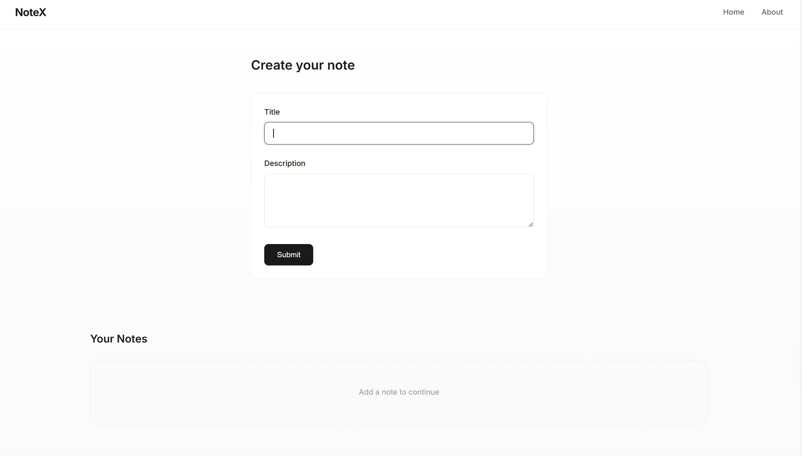
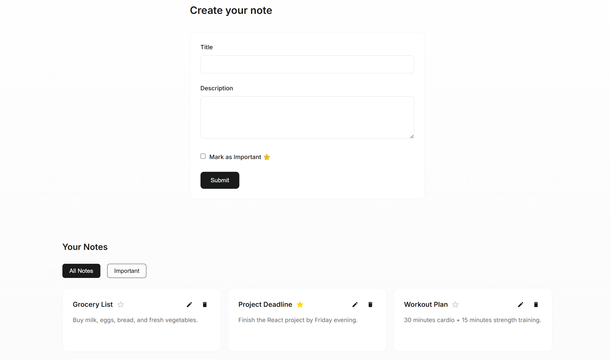
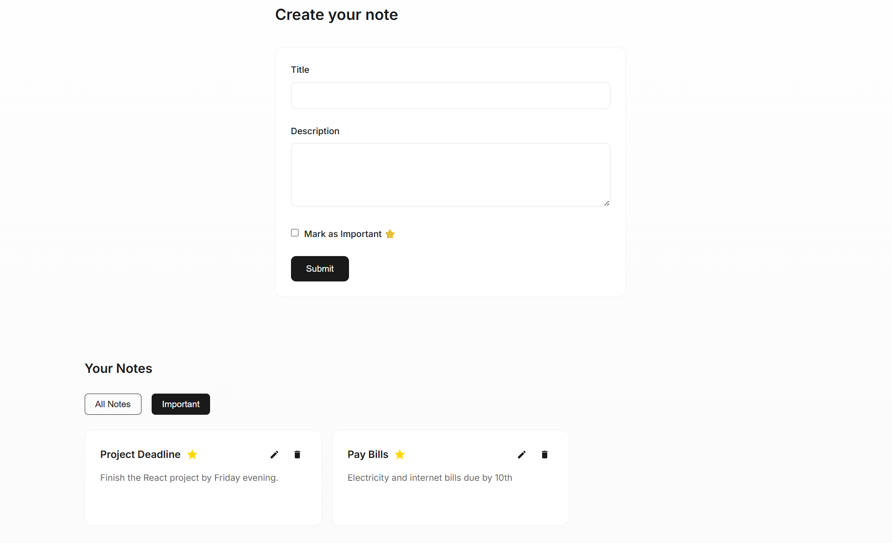

# 📝 NoteX - Your Smart Note-Taking App

NoteX is a simple, interactive, and **feature-rich note-taking application** built with **React** and **Node.js (Express + MongoDB)**. Keep track of your tasks, mark important notes, and quickly search through them!  

✨ Designed to be lightweight, responsive, and user-friendly.

---

## 🚀 Features

- ✅ Create, update, and delete notes  
- ⭐ Mark notes as **Important**  
- 🔍 Live **Search** across titles and descriptions  
- 📂 Filter between **All Notes** and **Important Notes**  
- ⚡ Quick and smooth UX with responsive design  
- 🛡️ Validation for empty fields and duplicate titles  

---

## 🖥️ Demo

[Live Demo Link Here](#) *(Add your Vercel/Netlify link)*

---

## 📷 Screenshots




---

## 🛠️ Tech Stack

- **Frontend:**  
    
- **Backend:**  
    
    
- **Database:**  
  
  
- ⚡ **Axios** for API calls  
- 🎨 **Tailwind CSS** for styling  

---

## 🖇️ Installation

1. Clone the repository  
```bash
git clone https://github.com/Ritupagar12/NoteX-App.git
```
2. Install dependencies in both frontend and backend folders
```bash
cd backend
npm install
```
```bash
cd ../frontend
npm install
```
3. Create a .env file in the backend with the MongoDB connection string
```bash
MONGO_URI=your_mongodb_connection_string
PORT=5000
```
4. Start the backend server
```bash
npm run dev
```
5. Start the frontend server
```bash
npm start
```
6. Open your browser and enjoy!


