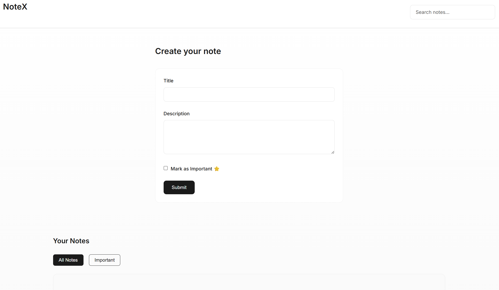

# 📝 NoteX - React Notes App

A simple, responsive notes app built with **React** and **Vite**.  
You can create, view, and delete notes — all stored safely in your browser using `localStorage`.

---

## 🚀 Features

- ✏️ Create notes with a title and description  
- 🗑️ Delete notes easily  
- 💾 Automatically saves notes in `localStorage`  
- 💡 Notes persist after refresh  
- 📱 Responsive design for mobile and desktop  
- ⚡ Built using modern React (Hooks + Components)

---

## 🧠 What You’ll Learn

This project is perfect for beginners learning React. It covers:

- Components (`App`, `Navbar`, `Card`)
- Props and State Management
- React Hooks: `useState`, `useEffect`
- Controlled Form Inputs
- LocalStorage Integration
- Conditional Rendering
- Styling with CSS Grid & Flexbox

---

## 🛠️ Tech Stack

- **React (Vite)**
- **React Icons**
- **CSS3**
- **LocalStorage API**

---

## 📂 Folder Structure
src/  
├── components/  
│ ├── Card.jsx # Displays each note  
│ └── Navbar.jsx # Top navigation bar  
├── App.jsx # Main app logic and state  
├── App.css # Component-specific styles  
├── index.jsx # Entry point  
└── index.css # Global styles  
---

## ⚙️ Setup Instructions

Follow these steps to run the app locally:

### 1. Clone the Repository
```bash
git clone https://github.com/Ritupagar12/notex-react-app.git
```
2. Navigate into the Folder
```bash
cd notex-react-app
```
3. Install Dependencies
```bash
npm install
```
4. Start the Development Server
```bash
npm run dev
```
5. Now open your browser and visit:
```bash
http://localhost:5173
```
You’ll see *NoteX* running!
---
## 💾 How It Works
- When the app loads, it checks localStorage for existing notes.
- You can type a title and description, then click Submit.
- The note appears instantly on the screen.
- It’s also saved in your browser, so if you refresh, it stays.
- Click the 🗑️ icon to delete a note; it disappears from both the screen and storage.
---
## 🎯 Demo Preview

Here’s what the app looks like 👇



